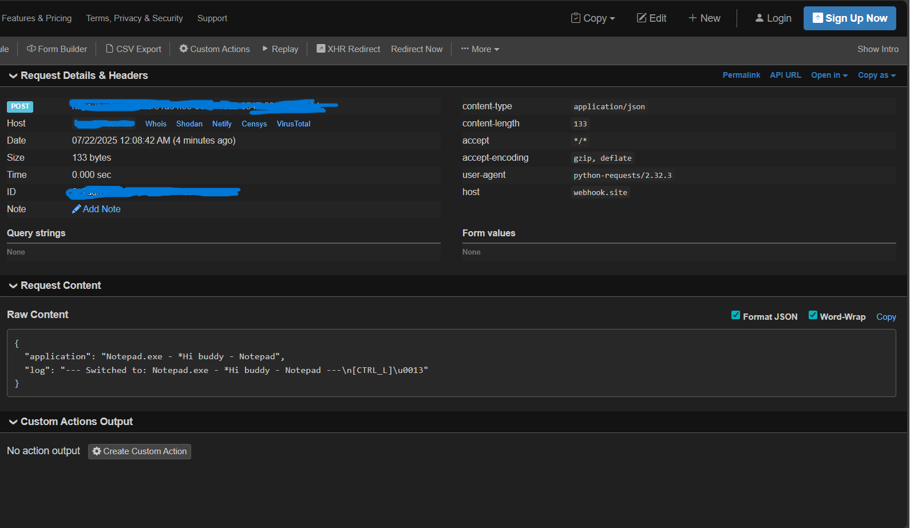

# 🛡️ Basic Python Keylogger (Windows)

> ⚠️ **DISCLAIMER**: This tool is for **educational and authorized security research** only. Unauthorized use is strictly prohibited and may be illegal.

---

## 📌 Overview

A lightweight, **Windows-only keylogger** built in Python that runs silently, captures keyboard input, tracks active application changes, and logs everything per session. On closing or switching applications, the data is automatically sent to a specified **Webhook URL** or **Personal Website URL**. This tool is tested in Windows 24H2, and the antivirus doesn't detect it.

---

## 🚀 Features

- ✅ Runs invisibly in the background (no command prompt)
- ✅ Captures copied (CTRL+c) content
- ✅ Detects when the user switches applications
- ✅ Logs all keystrokes
- ✅ Sends collected data to a remote **webhook**
- ✅ Easy to modify and expand for research needs

---

## 📋 Requirements

Make sure you have **Python 3.7+** and install the required libraries:
```bash
    pip install pynput requests psutil pywin32
```

---

## 🛠️ Installation & Setup

### 🔗 1. Clone or Download the Repository

```bash
    git clone https://github.com/Codewith-Vedant/Python-Keylogger
    cd Python-Keylogger
```

### ⚙️ 2. Configure Webhook

Edit `keylogger.py` and set your own webhook URL:
```bash
    WEBHOOK_URL = "https://your-webhook-url.here" #Or you can paste your own site endpoint
```

You can create a free webhook for testing at [https://webhook.site](https://webhook.site).

### ⚙️ 3. Create an application(optional)
```bash
    pip install pyinstaller
    python -m PyInstaller --noconsole --onefile key.py
```

---

## ▶️ Running the Logger
```bash
    python keylogger.py
```

A working POC video is demonstrated in [POC](poc.mp4)

## Output Sample:
The following screenshot is an output sample using Webhook

---

## 🔐 Ethical Usage

This project is created for:

- ✅ Red teaming and penetration testing (with consent)
- ✅ User behavior analytics (authorized environments)
- ✅ Personal system monitoring
- ❌ **Do NOT use this for illegal surveillance or activity**

Misuse may be illegal under **cybercrime and privacy laws** in your country.

---

## Libraries Used:

- ✅ [pynput](https://pynput.readthedocs.io/en/latest/) for capturing keystrokes  
- ✅ [pywin32](https://github.com/mhammond/pywin32) to access Windows API  
- ✅ [psutil](https://psutil.readthedocs.io/en/latest/) for process tracking  
- ✅ [requests](https://docs.python-requests.org/) for webhook data transfer

---

## 👨‍💻 Author

Security tool built for learning, personal auditing, and research by [Vedant Pillai aka Titan-Hack](https://www.linkedin.com/in/vedant0701/)

---

